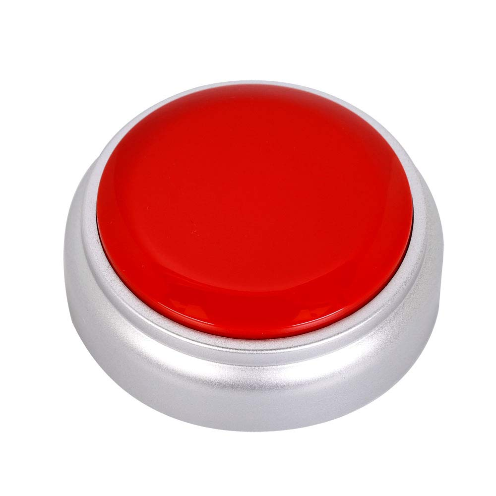

___
# МИНИСТЕРСТВО НАУКИ И ВЫСШЕГО ОБРАЗОВАНИЯ РОССИЙСКОЙ ФЕДЕРАЦИИ ФЕДЕРАЛЬНОЕ ГОСУДАРСТВЕННОЕ БЮДЖЕТНОЕ ОБРАЗОВАТЕЛЬНОЕ УЧРЕЖДЕНИЕ ВЫСШЕГО ПРОФЕСИОНАЛЬНОГО ОБРАЗОВАНИЯ «САХАЛИНСКИЙ ГОСУДАРСТВЕННЫЙ УНИВЕРСИТЕТ»
### ***<center>Лабораторная работа №6. «Модель DOM».</center>*** <br><p align="right">Подготовил студент направления подготовки 01.03.02 «Прикладная математика и информатика»<br> Института естественных наук и техносферной безопасности<br> Зураев Дмитрий Бакенович.</p><br><p align="right">Научный руководитель:<br> Соболев Евгений Игоревич</p><br> <center>Южно-Сахалинск 2023 г.</center>
___
### <center>Введение</center>
<p align="justify">JavaScript (JS) - это высокоуровневый язык программирования, который используется для создания интерактивных и динамических веб-страниц. JS является одним из трех основных языков, используемых веб-браузерами (наряду с HTML и CSS), и позволяет добавлять функциональность и взаимодействие на веб-страницах.
Лабораторная работа по JavaScript (JS) предоставляет возможность познакомиться с одним из самых популярных языков программирования, используемых для разработки веб-приложений.</p>

### <center>Цели</center>
<p align="justify"></p>

### <center>Задачи</center>
<p align="justify">Применить технологию JS.</p>

____________________
## <center>_Решение_</center>
<h3 align="center"><i>JS code</i></h3>

```js
function task1() {
    alert("Кнопка была нажата!");
  }
  
  function task2() {
    var input = document.getElementById('myInput');
    input.value = "Новый текст!";
  }
  
  function task3() {
    var input = document.getElementById('myyInput').value;
    alert(input);
  }
  
  function task4() {
    alert(Math.pow(document.getElementById('myyInputt').value, 2))
  }
  
  function task5() {
    var temp = document.getElementById('input51').value; 
    document.getElementById('input51').value = document.getElementById('input52').value; 
    document.getElementById('input52').value = temp;
  }
  
  function task6() {
    this.innerHTML = 'Текст кнопки поменялся';
  }
  
  function task7() {
    document.getElementById('Inputs').style.color = 'red'
  }
  
  function task8() {
    document.getElementById('Innput').disabled = true;
  }
  
  function task81() {
    document.getElementById('Innput').disabled = false;
  }
  
  
  function task12() {
    document.getElementById('myImage').src = 'new.jpg'
  }
   
  var clickCount = 0;
  function task16() {
    clickCount++;
    document.getElementById("clickCount").innerHTML = "Количество нажатий: " + clickCount;
  }
     
  
  function task18() {
      document.getElementById('hide').style.display = 'none';
  }
  
  function task20() {
    function calculate(num1, operator, num2) {
      switch (operator) {
        case '+':
          return num1 + num2;
        case '-':
          return num1 - num2;
        case '*':
          return num1 * num2;
        case '/':
          if (num2 !== 0) {
            return num1 / num2;
          } else {
            return 'Ошибка: Деление на ноль невозможно!';
          }
        default:
          return 'Ошибка: Неверный оператор!';
      }
    }
    const number1 = parseFloat(prompt('Введите первое число:'));
    const operator = prompt('Введите оператор (+, -, *, /):');
    const number2 = parseFloat(prompt('Введите второе число:'));
    const result = calculate(number1, operator, number2);
    
    alert(`Результат: ${result}`);
  }
```
<h3 align="center"><i>HTML code</i></h3>

```html
<!DOCTYPE html>
<html>
 <head>
  <script src="script.js"></script>
  <title>6</title>
  <meta charset="utf-8">
  <meta name="viewport" content="width=device-width, initial-scale=1">
 </head>
 <body>
  
<h1>Лабораторная 6</h1>
<p>
    <button onclick="task1()">1 Задание</button>
</p>

<p>
    <button onclick="task2()">2 Задание</button>
    <input type="text" id="myInput" value="hello world">
</p>

<p>
  <button onclick="task3()">3 Задание</button>
  <input type="text" id="myyInput" value="hello world">
</p>

<p>
  <button onclick="task4()">4 Задание</button>
  <input type="number" id="myyInputt" value="3">
</p>

<p>
  <button onclick="task5()">5 Задание</button>
  <input type="text" id="input51" value="hello">
  <input type="text" id="input52" value="world">
</p>

<p>
  <button onclick="this.innerHTML = 'Текст поменялся'">6 Задание</button>
</p>

<p>
  <button onclick="task7()">7 Задание</button>
  <input type="text" id="Inputs" value="hello world">
</p>

<p>
  <button onclick="task8()">8 Задание(блокировать)</button>
  <button onclick="task81()">8 Задание(разблокировать)</button>
  <input type="text" id="Innput" value="hello world">
</p>

<p>
  <button onmouseover="alert('Вы навелись на кнопку')">9 Задание</button>
</p>

<p>
  <button ondblclick="alert('двойное нажатие')">10 Задание</button>
</p>

<style>
	.a {
	 border: 2px double rgba(121, 121, 121, 0); 
	 background-color: rgb(216, 216, 216);
	 width:100px;
	}
</style>

<p>
  <div class="a" onmouseover="alert('Наведение на область')">11 Задание</div>
</p>

<p>
  <button onclick="task12()">12 Задание</button><br>
  
</p>

<p>
  <button onclick="alert(this.innerHTML)">13 Задание</button>
</p>

<p>
  <input type="text" id="Inputqq" value="sdadadsa">
  <button onclick="this.previousElementSibling.value = 'Изменён'">14 Задание</button>
</p>

<p>
  <button onclick="this.disabled = true;">15 Задание</button>
</p>

<p>
  <button onclick="task16()">16 Задание</button>
<p id="clickCount">Количество нажатий: 0</p>
</p>

<p>
  <button onclick="this.style.cursor = 'pointer'">17 Задание</button>
</p>

<p>
  <button onclick="task18()">18 Задание</button>
  <p id="hide">id=hide</p>
</p>

<p>
  <button onclick="this.style.display = 'none'">19 Задание</button>
</p>

<p>
  <button onclick="task20()">20 Задание</button>
</p>

</body>
</html>
```
<center><b>Задачи CodeWars:</b></center>

[1 Kata](https://www.codewars.com/kata/the-coupon-code)
```javascript
function checkCoupon(enteredCode, correctCode, currentDate, expirationDate) {
  if (enteredCode !== correctCode) {
    return false;
  }

  const current = new Date(currentDate);
  const expiration = new Date(expirationDate);

  return current <= expiration;
}
```
[2 Kata](https://www.codewars.com/kata/unlucky-days)
```javascript
function unluckyDays(year) {
  let count = 0;

  for (let month = 0; month < 12; month++) {
    const date = new Date(year, month, 13);

    if (date.getDay() === 5) {
      count++;
    }
  }

  return count;
}
```
[3 Kata](https://www.codewars.com/kata/angle-between-clock-hands)
```javascript
function handAngle (date) {
  var pi2 = Math.PI*2;
  var m = date.getMinutes()/60, h = (date.getHours()+m)/12;
  
  var angle = Math.abs(h-m)*pi2;
  return Math.min( angle, pi2-angle )

}
```
[4 Kata](https://www.codewars.com/kata/my-language-skills)
```javascript
function myLanguages(results) {
  const filteredResults = Object.entries(results)
    .filter(([language, score]) => score >= 60)
    .sort(([languageA, scoreA], [languageB, scoreB]) => scoreB - scoreA)
    .map(([language, score]) => language);

  return filteredResults;
}
```
[5 Kata](5.	https://www.codewars.com/kata/run-length-encoding)
```javascript
var runLengthEncoding = function(str) {
  if (str.length === 0) {
    return [];
  }

  const result = [];
  let count = 1;  

  for (let i = 1; i < str.length; i++) {
    if (str[i] === str[i - 1]) {
      count++;
    } else {
      result.push([count, str[i - 1]]);
      count = 1;
    }
  }

  result.push([count, str[str.length - 1]]);

  return result;
};

```
[6 Kata](https://www.codewars.com/kata/walk-the-object-path)
```javascript
function find(object, path) {
  const keys = path.split('.');

  for (let key of keys) {
    if (object != null && object.hasOwnProperty(key)) {
      object = object[key];
    } 

    else {
      return undefined;
    }
  }

  return object;
}

```
## <center>_Вывод_</center>
Таким образом, мне удалось поработать со свойствами кнопки и с интересным интерфейсом innerjs, он оказался очень полезным и удобным.